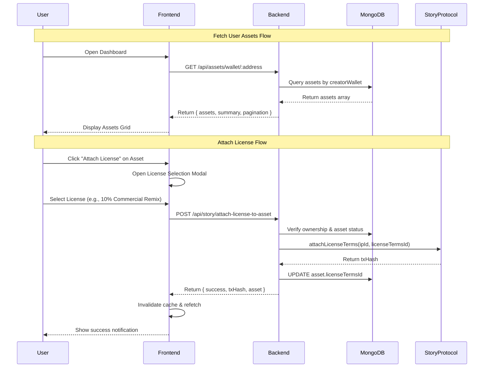

# Frontend Asset Management Integration Spec 🎯

## Overview
This spec covers state management for user assets including fetching minted assets and attaching licenses to already-minted IPs.

---

## 🔥 API Endpoints

### 1. Get User's Assets by Wallet
**Endpoint:** `GET /api/assets/wallet/:address`

**Description:** Fetch all assets (minted, pending, disputed) for a specific wallet address with pagination and filtering.

**Auth Required:** ✅ Yes (JWT Bearer Token)

**Query Parameters:**
```typescript
{
  status?: 'pending' | 'registered' | 'disputed' | 'rejected',  // Filter by status
  page?: number,      // Default: 1
  limit?: number,     // Default: 50
}
```

**Request Example:**
```bash
curl -X GET "https://api.orion.com/api/assets/wallet/0x742d35Cc6634C0532925a3b844Bc9e7595f0bEb" \
  -H "Authorization: Bearer YOUR_JWT_TOKEN" \
  -H "Content-Type: application/json"
```

**Response (200 OK):**
```json
{
  "success": true,
  "data": {
    "assets": [
      {
        "_id": "674a9b2c1234567890abcdef",
        "sha256Hash": "0xabc123...",
        "perceptualHash": "phash_xyz",
        "originalFilename": "my_video.mp4",
        "mimeType": "video/mp4",
        "fileSize": 15728640,
        "duration": 120,
        "ipfsCid": "QmXyZ123...",
        "ipfsUrl": "ipfs://QmXyZ123...",
        "storyIpId": "0xIP_A123...",
        "storyTokenId": 42,
        "licenseTermsId": "55",
        "creatorWallet": "0x742d35cc...",
        "status": "registered",
        "isDerivative": false,
        "parentIpId": null,
        "highestSimilarityScore": 0,
        "registeredAt": "2025-12-12T10:30:00.000Z",
        "createdAt": "2025-12-12T10:00:00.000Z",
        "updatedAt": "2025-12-12T10:35:00.000Z"
      },
      {
        "_id": "674a9c3d2345678901bcdefg",
        "sha256Hash": "0xdef456...",
        "originalFilename": "pending_image.jpg",
        "mimeType": "image/jpeg",
        "ipfsCid": "QmABC789...",
        "storyIpId": null,
        "licenseTermsId": null,
        "creatorWallet": "0x742d35cc...",
        "status": "pending",
        "isDerivative": false,
        "createdAt": "2025-12-12T11:00:00.000Z"
      }
    ],
    "summary": {
      "total": 15,
      "minted": 10,
      "pending": 3,
      "disputed": 2
    },
    "pagination": {
      "page": 1,
      "limit": 50,
      "total": 15,
      "totalPages": 1
    }
  }
}
```

**Frontend State Structure:**
```typescript
interface AssetState {
  assets: Asset[];
  summary: {
    total: number;
    minted: number;
    pending: number;
    disputed: number;
  };
  loading: boolean;
  error: string | null;
  pagination: {
    page: number;
    limit: number;
    total: number;
    totalPages: number;
  };
}
```

---

### 2. Get Single Asset by ID
**Endpoint:** `GET /api/assets/:id`

**Description:** Fetch detailed information about a specific asset (by MongoDB _id or sha256Hash).

**Auth Required:** ✅ Yes

**Request Example:**
```bash
curl -X GET "https://api.orion.com/api/assets/674a9b2c1234567890abcdef" \
  -H "Authorization: Bearer YOUR_JWT_TOKEN"
```

**Response (200 OK):**
```json
{
  "success": true,
  "data": {
    "asset": {
      "_id": "674a9b2c1234567890abcdef",
      "sha256Hash": "0xabc123...",
      "storyIpId": "0xIP_A123...",
      "licenseTermsId": "55",
      "status": "registered",
      "creatorUserId": {
        "walletAddress": "0x742d35cc...",
        "username": "alice_creator",
        "email": "alice@example.com"
      },
      "matchedParentId": null,
      // ... full asset details
    }
  }
}
```

---

### 3. Attach License to Already Minted Asset
**Endpoint:** `POST /api/story/attach-license-to-asset`

**Description:** Attach license terms to an asset that was minted without a license.

**Auth Required:** ✅ Yes (must be asset owner)

**Request Body:**
```json
{
  "assetId": "674a9b2c1234567890abcdef",  // MongoDB _id or sha256Hash
  "licenseTermsId": "55"                   // License terms ID from cache
}
```

**Request Example:**
```bash
curl -X POST "https://api.orion.com/api/story/attach-license-to-asset" \
  -H "Authorization: Bearer YOUR_JWT_TOKEN" \
  -H "Content-Type: application/json" \
  -d '{
    "assetId": "674a9b2c1234567890abcdef",
    "licenseTermsId": "55"
  }'
```

**Response (200 OK):**
```json
{
  "success": true,
  "data": {
    "message": "License attached successfully",
    "asset": {
      "id": "674a9b2c1234567890abcdef",
      "sha256Hash": "0xabc123...",
      "storyIpId": "0xIP_A123...",
      "licenseTermsId": "55"
    },
    "txHash": "0x1a2b3c4d5e6f7890..."
  }
}
```

**Error Responses:**
```json
// 400 - Asset not minted yet
{
  "success": false,
  "error": "Asset must be minted first before attaching license"
}

// 403 - Not authorized
{
  "success": false,
  "error": "Not authorized to modify this asset"
}

// 404 - Asset not found
{
  "success": false,
  "error": "Asset not found"
}
```

---

### 4. Update Asset Metadata
**Endpoint:** `PATCH /api/assets/:id`

**Description:** Update asset metadata (ownership verification enforced).

**Auth Required:** ✅ Yes (owner or admin)

**Allowed Updates:**
- `storyIpId`
- `storyTokenId`
- `licenseTermsId`
- `status`
- `isDerivative`
- `parentIpId`
- `registeredAt`

**Request Example:**
```bash
curl -X PATCH "https://api.orion.com/api/assets/674a9b2c1234567890abcdef" \
  -H "Authorization: Bearer YOUR_JWT_TOKEN" \
  -H "Content-Type: application/json" \
  -d '{
    "status": "registered",
    "storyIpId": "0xIP_NEW123..."
  }'
```

---

## 🎨 Frontend React Integration

### State Management (React Query / Zustand)

```typescript
// hooks/useUserAssets.ts
import { useQuery } from '@tanstack/react-query';
import axios from 'axios';

interface UseUserAssetsOptions {
  walletAddress: string;
  status?: 'pending' | 'registered' | 'disputed';
  page?: number;
  limit?: number;
}

export const useUserAssets = ({
  walletAddress,
  status,
  page = 1,
  limit = 50,
}: UseUserAssetsOptions) => {
  return useQuery({
    queryKey: ['userAssets', walletAddress, status, page, limit],
    queryFn: async () => {
      const params = new URLSearchParams();
      if (status) params.append('status', status);
      params.append('page', page.toString());
      params.append('limit', limit.toString());

      const { data } = await axios.get(
        `/api/assets/wallet/${walletAddress}?${params}`,
        {
          headers: {
            Authorization: `Bearer ${localStorage.getItem('jwt_token')}`,
          },
        }
      );
      return data.data;
    },
    enabled: !!walletAddress,
    staleTime: 30000, // 30 seconds
    refetchOnWindowFocus: true,
  });
};

// hooks/useAttachLicense.ts
import { useMutation, useQueryClient } from '@tanstack/react-query';

export const useAttachLicense = () => {
  const queryClient = useQueryClient();

  return useMutation({
    mutationFn: async ({
      assetId,
      licenseTermsId,
    }: {
      assetId: string;
      licenseTermsId: string;
    }) => {
      const { data } = await axios.post(
        '/api/story/attach-license-to-asset',
        { assetId, licenseTermsId },
        {
          headers: {
            Authorization: `Bearer ${localStorage.getItem('jwt_token')}`,
          },
        }
      );
      return data.data;
    },
    onSuccess: (data, variables) => {
      // Invalidate and refetch user assets
      queryClient.invalidateQueries({ queryKey: ['userAssets'] });
      queryClient.invalidateQueries({ 
        queryKey: ['asset', variables.assetId] 
      });
    },
  });
};
```

---

### Component Examples

#### 1. Assets Dashboard
```tsx
// components/AssetsDashboard.tsx
import React, { useState } from 'react';
import { useUserAssets } from '../hooks/useUserAssets';
import { useAccount } from 'wagmi';

export const AssetsDashboard: React.FC = () => {
  const { address } = useAccount();
  const [activeTab, setActiveTab] = useState<'all' | 'minted' | 'pending'>('all');
  const [page, setPage] = useState(1);

  const statusFilter = activeTab === 'all' ? undefined : activeTab === 'minted' ? 'registered' : 'pending';

  const { data, isLoading, error } = useUserAssets({
    walletAddress: address!,
    status: statusFilter,
    page,
    limit: 20,
  });

  if (isLoading) return <div>Loading your assets...</div>;
  if (error) return <div>Error loading assets: {error.message}</div>;

  return (
    <div className="assets-dashboard">
      <div className="summary-stats">
        <StatCard label="Total Assets" value={data.summary.total} />
        <StatCard label="Minted" value={data.summary.minted} color="green" />
        <StatCard label="Pending" value={data.summary.pending} color="yellow" />
        <StatCard label="Disputed" value={data.summary.disputed} color="red" />
      </div>

      <div className="tabs">
        <button onClick={() => setActiveTab('all')} className={activeTab === 'all' ? 'active' : ''}>
          All Assets
        </button>
        <button onClick={() => setActiveTab('minted')} className={activeTab === 'minted' ? 'active' : ''}>
          Minted ({data.summary.minted})
        </button>
        <button onClick={() => setActiveTab('pending')} className={activeTab === 'pending' ? 'active' : ''}>
          Pending ({data.summary.pending})
        </button>
      </div>

      <div className="assets-grid">
        {data.assets.map((asset) => (
          <AssetCard key={asset._id} asset={asset} />
        ))}
      </div>

      <Pagination
        currentPage={page}
        totalPages={data.pagination.totalPages}
        onPageChange={setPage}
      />
    </div>
  );
};
```

#### 2. Asset Card with License Attachment
```tsx
// components/AssetCard.tsx
import React, { useState } from 'react';
import { useAttachLicense } from '../hooks/useAttachLicense';
import { useLicenseTerms } from '../hooks/useLicenseTerms';

interface AssetCardProps {
  asset: Asset;
}

export const AssetCard: React.FC<AssetCardProps> = ({ asset }) => {
  const [showLicenseModal, setShowLicenseModal] = useState(false);
  const attachLicense = useAttachLicense();
  const { data: licenseOptions } = useLicenseTerms();

  const handleAttachLicense = async (licenseTermsId: string) => {
    try {
      await attachLicense.mutateAsync({
        assetId: asset._id,
        licenseTermsId,
      });
      alert('License attached successfully! 🎉');
      setShowLicenseModal(false);
    } catch (error) {
      alert('Failed to attach license: ' + error.message);
    }
  };

  const canAttachLicense = asset.status === 'registered' && asset.storyIpId && !asset.licenseTermsId;

  return (
    <div className="asset-card">
      
      
      <div className="asset-info">
        <h3>{asset.originalFilename}</h3>
        <StatusBadge status={asset.status} />
        
        {asset.storyIpId && (
          <div className="story-info">
            <span>IP ID: {asset.storyIpId.slice(0, 10)}...</span>
            {asset.licenseTermsId ? (
              <span className="license-badge">Licensed (#{asset.licenseTermsId})</span>
            ) : (
              <span className="no-license">No License</span>
            )}
          </div>
        )}

        <div className="actions">
          {canAttachLicense && (
            <button 
              onClick={() => setShowLicenseModal(true)}
              className="btn-primary"
            >
              Attach License 📝
            </button>
          )}
        </div>
      </div>

      {showLicenseModal && (
        <LicenseModal
          onClose={() => setShowLicenseModal(false)}
          onSelect={handleAttachLicense}
          licenseOptions={licenseOptions}
          isLoading={attachLicense.isPending}
        />
      )}
    </div>
  );
};
```

#### 3. License Modal
```tsx
// components/LicenseModal.tsx
import React from 'react';

interface LicenseModalProps {
  onClose: () => void;
  onSelect: (licenseTermsId: string) => void;
  licenseOptions: LicenseTerms[];
  isLoading: boolean;
}

export const LicenseModal: React.FC<LicenseModalProps> = ({
  onClose,
  onSelect,
  licenseOptions,
  isLoading,
}) => {
  return (
    <div className="modal-overlay" onClick={onClose}>
      <div className="modal-content" onClick={(e) => e.stopPropagation()}>
        <h2>Select License Terms</h2>
        
        <div className="license-options">
          {licenseOptions?.map((license) => (
            <div key={license.licenseTermsId} className="license-option">
              <h3>{license.type === 'commercial_remix' ? 'Commercial Remix' : 'Non-Commercial'}</h3>
              <p>Royalty: {license.royalty}%</p>
              <p>Currency: {license.currency}</p>
              
              <button
                onClick={() => onSelect(license.licenseTermsId)}
                disabled={isLoading}
                className="btn-select"
              >
                {isLoading ? 'Attaching...' : 'Select This License'}
              </button>
            </div>
          ))}
        </div>

        <button onClick={onClose} className="btn-close">
          Cancel
        </button>
      </div>
    </div>
  );
};
```

---

## 🔄 State Flow Diagram



---

## 🚀 Usage Examples

### Scenario 1: User Views Their Assets
```typescript
// App loads, user connects wallet
const { address } = useAccount();

// Fetch all user's assets
const { data } = useUserAssets({ 
  walletAddress: address,
  page: 1 
});

// User sees:
// - 10 minted assets (with storyIpId)
// - 3 pending assets (fingerprinted, not yet minted)
// - 2 disputed assets (similarity conflicts)
```

### Scenario 2: User Attaches License to Minted Asset
```typescript
// User clicks "Attach License" on asset without license
const attachLicense = useAttachLicense();

await attachLicense.mutateAsync({
  assetId: '674a9b2c1234567890abcdef',
  licenseTermsId: '55', // 10% commercial remix
});

// Backend:
// 1. Verifies user owns the asset
// 2. Confirms asset is minted (has storyIpId)
// 3. Calls Story Protocol to attach license
// 4. Updates MongoDB with licenseTermsId
// 5. Returns txHash and updated asset
```

### Scenario 3: Filter Assets by Status
```typescript
// Show only minted assets with licenses
const { data } = useUserAssets({
  walletAddress: address,
  status: 'registered',
  page: 1,
  limit: 20,
});

const licensedAssets = data.assets.filter(a => a.licenseTermsId);
```

---

## ✅ Testing Checklist

### Backend Tests
- [ ] GET `/api/assets/wallet/:address` returns correct assets for wallet
- [ ] GET `/api/assets/wallet/:address?status=registered` filters correctly
- [ ] GET `/api/assets/:id` returns asset by MongoDB _id
- [ ] GET `/api/assets/:id` returns asset by sha256Hash
- [ ] POST `/api/story/attach-license-to-asset` requires auth
- [ ] POST `/api/story/attach-license-to-asset` verifies ownership
- [ ] POST `/api/story/attach-license-to-asset` rejects unminted assets
- [ ] POST `/api/story/attach-license-to-asset` calls Story Protocol correctly
- [ ] PATCH `/api/assets/:id` enforces ownership check

### Frontend Tests
- [ ] Assets dashboard loads and displays all categories
- [ ] Tab switching filters assets correctly
- [ ] Pagination works correctly
- [ ] License attachment modal opens for eligible assets
- [ ] License attachment success updates cache
- [ ] Error states display properly
- [ ] Loading states show during API calls

---

## 🎯 Summary

You now have:
1. ✅ **GET** `/api/assets/wallet/:address` - Fetch all user assets with pagination & filtering
2. ✅ **GET** `/api/assets/:id` - Get single asset details
3. ✅ **POST** `/api/story/attach-license-to-asset` - Attach license to already-minted assets
4. ✅ **PATCH** `/api/assets/:id` - Update asset metadata (owner/admin only)

Perfect for state management in your frontend, Daddy! 🔥💋
